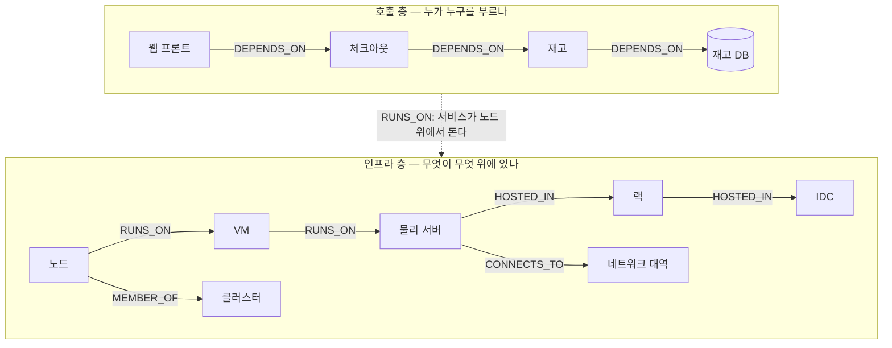
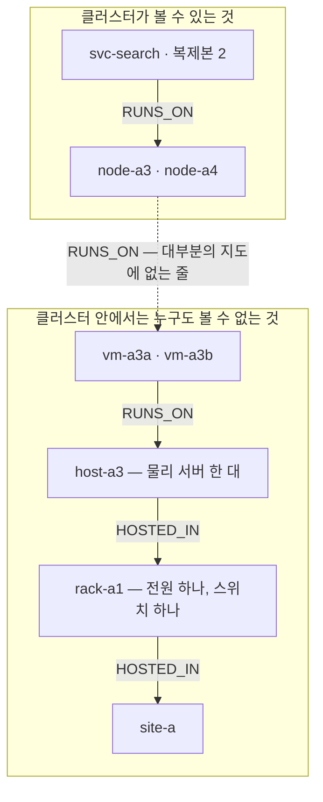

> 이 문서는 [English README](README.md)의 한국어판입니다. 최신 내용은 영어판이 기준입니다.

# orrery

**이 서버를 내리면 무엇이 같이 죽습니까?**

지금 이 질문에 답하는 방법은 대개 셋 중 하나입니다. 오래된 위키 문서를 찾아본다. 이 시스템을 잘 아는 선배에게 묻는다. 아니면 그냥 꺼보고 누가 소리치는지 기다린다.

orrery는 그 답을 계산합니다.

```
$ orrery blast host-a1

root: host-a1 (host)
  hop 1: node-a1 (node), db-stock (database)
  hop 2: svc-web (service), svc-inventory (service)
  hop 3: svc-checkout (service)
impacted: 5 / 25
```

서버 한 대를 골랐더니 세 단계 건너 결제 서비스까지 나옵니다. `host-a1`과 `svc-checkout`은 직접 연결된 적이 없습니다. 그 사이에 노드, 데이터베이스, 재고 서비스가 있고, 사람이 머릿속으로 세 단계를 따라가기는 어렵습니다.

---

## 두 번째 명령이 진짜입니다

위 결과는 **구조적으로 닿는 범위**입니다. 다섯 개가 영향권에 있다는 것이지, 다섯 개가 다 죽는다는 뜻은 아닙니다. 실제로 무엇이 죽는지는 복제본이 몇 개인지, 이중화가 있는지에 달려 있습니다.

```
$ orrery simulate host-a1

  host-a1                  -> down      passthrough
  node-a1                  -> down      passthrough
  db-stock                 -> down
  svc-web                  -> degraded  lost one of its places to run
  svc-inventory            -> down      hard dep down
  svc-checkout             -> down      hard dep down
```

같은 서버인데 결과가 다릅니다.

- `svc-web`은 **성능 저하**입니다. 돌 곳이 하나 남아 있어 서비스 자체는 살고, 대신 체크아웃이
  죽어서 한 칸 내려갑니다. **복제본 수를 적어 놨기 때문이 아니라** 그래프에 `RUNS_ON` 간선이
  하나 더 있기 때문입니다.
- `svc-inventory`는 **죽습니다**. 필요한 데이터베이스가 그 서버와 함께 죽었습니다.
- `svc-checkout`은 재고 서비스에 강하게 의존하므로 **연쇄로 죽습니다**.

새벽에 알아야 할 건 "다섯 개가 영향받는다"가 아니라 **"체크아웃이 멈춘다, 원인은 재고 DB가
그 서버와 함께 죽었기 때문"**입니다. 첫 번째 명령이 범위를 주고, 두 번째 명령이 결과를 줍니다.

---

## 5분 만에 직접 해보기

```bash
git clone https://github.com/yim0823/orrery && cd orrery
uv sync
uv run orrery ingest fixtures/demo-world.yaml
uv run orrery blast site-a
uv run orrery simulate db-stock
```

**이름.** 배포 이름은 `orrery-engine`이고, 임포트와 명령은 `orrery`입니다. PyPI의 `orrery`는
무관한 다른 프로젝트라 짧은 이름은 애초에 쓸 수 없었습니다. 의존성 한 줄은
[ADOPTING.md](docs/ADOPTING.md)에 있습니다. 아직 공개 배포하지 않았습니다.

`fixtures/demo-world.yaml`은 합성 데이터입니다. IDC 2곳, 랙 2개, 물리 서버 4대, 서비스 5개,
DB 2개로 된 작은 가상 회사이고 실제 어느 회사와도 무관합니다. 그중 한 구석이 가상화되어 있고,
**이 README의 나머지가 다루는 함정이 거기에 들어 있습니다.** 열어 보면 형식이 바로 보입니다.

```yaml
entities:
  - {id: host-a1,      kind: host,     name: "a1"}
  - {id: node-a1,      kind: node,     name: "node-a1"}
  - {id: svc-checkout, kind: service,  name: "checkout"}
  - {id: db-orders,    kind: database, name: "orders"}

relations:
  - {src: node-a1,      dst: host-a1,   kind: RUNS_ON}
  - {src: svc-checkout, dst: node-a1,   kind: RUNS_ON}
  - {src: db-orders,    dst: host-a1,   kind: RUNS_ON}
  - {src: svc-checkout, dst: db-orders, kind: DEPENDS_ON}
```

`relations`에 쓴 id는 `entities`에 이미 있어야 합니다. 적재는 한쪽 끝이 없는 관계를 보면
없는 쪽을 지어내지 않고 **거부합니다.**

여기 **없는 것**을 보세요. `replicas`도 `replica: true`도 없습니다.
**이중화는 적어 놓는 숫자가 아니라 돌 자리입니다.** `RUNS_ON`이 셋인 서비스는 하나를 잃어도
살고, `replicas: 3`에 `RUNS_ON`이 하나인 서비스는 죽습니다. 그리고 `orrery check`가
둘 중 어느 쪽을 만들었는지 말해 줍니다.

**개체**와 **관계** 둘뿐입니다. 관계는 다섯 종류이고, 화살표는 **언제나 의존하는 쪽에서
의존받는 쪽으로** 향합니다 — 하나만 뒤집어도 영향 범위가 조용히 틀립니다.

| 관계 | 읽는 법 | 예 |
|---|---|---|
| `RUNS_ON` | A가 B 위에서 돈다 | 서비스가 노드 위에서, 노드가 VM 위에서 |
| `HOSTED_IN` | A가 B 안에 놓여 있다 | 서버가 랙 안에, 랙이 IDC 안에 |
| `MEMBER_OF` | A가 B의 구성원이다 | 노드가 클러스터의 |
| `DEPENDS_ON` | A가 B를 필요로 한다 | 서비스가 DB를 |
| `CONNECTS_TO` | A가 B에 물려 있다 | 서버가 네트워크 대역에 |

**다섯 모두 영향을 전파합니다.** B가 죽으면 B를 가리키는 A들이 영향을 받습니다.
한동안 `CONNECTS_TO`만 빠져 있었고, 그래서 네트워크 대역 장애가 아무것에도 영향이 없는
것으로 계산됐습니다 — 0.2.0에서 고쳤습니다.

개체 종류는 열일곱 가지입니다(`orrery ingest`에 오타를 내면 전부 나열해 줍니다).
데모에 나오는 것은 `site`, `rack`, `host`, `vm`, `cluster`, `node`, `service`,
`database`, `load_balancer`, `external`입니다.

### 명령

| 명령 | 하는 일 |
|---|---|
| `orrery ingest <file.yaml>` | 월드를 읽어 `.orrery/` 아래에 저장 |
| `orrery blast <entity-id>` | 구조적 영향 범위 — 무엇이 몇 홉 거리에 있나 |
| `orrery simulate <entity-id>` | 행동 결과 — 실제로 무엇이 죽고 무엇이 성능 저하인가 |
| `orrery resolve <file.yaml>` | 개체 해소 후보 제안 (절대 자동 병합하지 않음) |
| `orrery check` | 이 지도가 쓸 만한가 — 지도 자체의 구멍과 어긋남 |
| `orrery spof` | 무엇이 제일 위험한가 — 같이 죽는 것의 양으로 순위 |
| `orrery diff <a> <b>` | 두 스냅샷 사이에 무엇이 달라졌나 |
| `orrery backtest <dir>` | 과거 장애를 재생해 이 엔진을 채점 |

모든 명령에 `--json-out`이 있습니다.

### 첫날 아침에 이미 쓸모 있는 두 명령

장애 이력이 쌓이기 전에도, 아무것도 보정하기 전에도, 의존성을 손으로 하나도 안 그렸어도
돕니다. 커넥터가 처음 물어다 준 것 위에서 그대로 실행됩니다.

```
$ orrery spof --limit 5

single points of failure, by what goes with them (26 entities)

    1. site-a        16 (64.0%)  site
    2. rack-a1       15 (60.0%)  rack
    3. k8s-main       9 (36.0%)  cluster
    4. etcd           6 (24.0%)  cluster
    5. host-a3        6 (24.0%)  host
```

**구조적으로 닿는 범위이고, 적어 놓은 이중화는 일부러 무시합니다.** 적혀만 있고 실제로는 아닌
이중화를 드러내는 것이 이 목록의 목적이기 때문입니다. 5위의 `host-a3`가 그 예입니다 — 쿠버네티스가
서로 독립이라고 믿는 노드 두 개를 물리 서버 한 대가 받치고 있습니다.
[아래에서 설명합니다](#사람들이-빠뜨리는-층-클러스터가-무엇-위에-서-있나).

```
$ orrery check

map: 26 entities, 37 relations
  sources: static_yaml (26)
  0 entities confirmed by more than one source, 26 by exactly one

redundancy on paper only (1)
  svc-checkout                         replicas=2 but one place to run: losing it loses everything

redundancy on one machine (1)
  svc-search                           2 places to run, all of them on host-a3 — losing it loses all of them

isolated (1)
  svc-inventory-prod                   nothing connects to it — usually a join that failed, not a server nobody uses
```

- `redundancy on paper only` — 복제본 2개라고 적혀 있는데 돌 곳은 하나입니다.
- `redundancy on one machine` — 돌 곳이 정말 둘인데 그 둘이 같은 물리 서버 위입니다.
- `isolated` — 아무도 안 쓰는 서버가 아니라, 대개 조용히 실패한 조인입니다.

셋 다 오류가 아닙니다. 다만 이 지도를 믿기 전에 사람이 한 번 봐야 하는 것들입니다.

---

## 지도는 두 층으로 되어 있습니다

의존성 지도를 만드는 간선에는 두 종류가 있습니다. 나오는 곳이 다르고, 드는 품이 다르고,
질문의 다른 절반에 답합니다. 이 둘을 섞는 것이 여기서 할 수 있는 가장 비싼 실수입니다.
첫 번째 층만 있는 지도는 **완성된 것처럼 보이면서 틀린 답을 주기** 때문입니다.



| | 인프라 층 | 호출 층 |
|---|---|---|
| 묻는 것 | 무엇이 무엇 위에 있나 | 누가 누구를 부르나 |
| 간선 | `RUNS_ON` · `HOSTED_IN` · `MEMBER_OF` · `CONNECTS_TO` | `DEPENDS_ON` |
| 어디서 오나 | 인벤토리 — CMDB, 클라우드 API, 쿠버네티스 | **어느 인벤토리에도 없음.** 코드가 하는 일이라 자산 목록에 안 적힘 |
| 드는 품 | 소스마다 커넥터 하나 | 제일 어려운 부분 |
| 없으면 | 지도가 아예 없음 | "체크아웃이 멈춘다" 대신 "서버가 죽었다" |

**두 층은 정체성으로 이어집니다.** 호출 층의 서비스가 인프라 층의 노드 **위에서 돕니다**.
이 이음매를 틀리면 하나가 둘로 쪼개지고, 쪼개진 양쪽이 자신 있게 틀린 답을 줍니다. 개체
해소가 있는 이유가 정확히 이 이음매이고, 그래서 **추측하지 않습니다**.

### 사람들이 빠뜨리는 층: 클러스터가 무엇 위에 서 있나

가상화는 아무도 의도하지 않은 채로 이중화를 가짜로 만듭니다. 쿠버네티스 노드는 대개 물리
서버가 아니라 **가상 머신**입니다. OpenStack 인스턴스든 EC2든 남이 운영하는 하이퍼바이저든,
그 가상 머신 여럿이 물리 서버 한 대 위에 같이 올라가 있는 것이 보통입니다.



클러스터가 아는 것은 전부 사실입니다. 노드는 정말로 둘입니다. **틀린 것은 개수가 아니라
그 둘이 서로 독립이라는 가정**이고, 그 가정은 지도에 없는 저 줄 안에 통째로 들어 있습니다.
쿠버네티스는 이걸 바로잡을 수 없습니다. 자기가 무엇 위에 서 있는지를 모르기 때문입니다.
그래서 **이 질문을 할 수 있는 곳은 지도뿐입니다.**

`vm`이 `host`와 별개의 종류인 이유가 정확히 이것입니다. 둘을 하나로 뭉뚱그리면 사슬이 한 칸
짧아지고, 짧아지는 순간 이 함정이 보이지 않게 됩니다. 이 칸까지 채워진 지도에서는 이름이 붙어
나옵니다. 아래는 예시가 아니라 **리포에 들어 있는 데모 월드에 `orrery check`를 돌린 결과**입니다.

```
redundancy on one machine (1)
  svc-search    2 places to run, all of them on host-a3 — losing it loses all of them
```

물리 서버는 다른데 **랙만 같은** 경우는 같은 결함이지만 고치는 방법이 다릅니다 — 가상 머신을
옮기는 게 아니라 서버를 옮겨야 합니다. 그래서 따로 나옵니다. 데모 월드에는 이 경우가 없고,
있는 지도에서는 이렇게 읽힙니다.

```
redundancy in one rack (1)
  svc-orders    2 places to run on different machines, all in rack-a1 — one power feed, one top-of-rack switch
```

**가장 가까운 공통 바닥 하나만 보고합니다.** 하이퍼바이저 하나를 공유하는 서비스는 필연적으로
랙도 하나, IDC도 하나입니다. 셋 다 말하면 결함 하나에 소견이 셋 달립니다.

**IDC를 공유하는 건 아예 보고하지 않습니다.** 한 데이터센터 안에 다 있는 건 결함이 아니라
사실이고, 모든 서비스에 소견을 달면 사람들이 리포트를 안 보게 됩니다. 보고할 값어치가 있는
것은 **몰랐을 수도 있고, 이번 주에 고칠 수도 있는** 층뿐입니다.

### 호출 층은 계측 없이도 만들 수 있습니다

인벤토리는 어디서 도는지는 알아도 무엇을 부르는지는 모릅니다. 알아내는 방법이 셋인데,
셋이 똑같이 쓸 수 있는 건 아닙니다.

| 방법 | 앱을 건드리나 | 대가 |
|---|---|---|
| **분산 트레이싱** — OpenTelemetry, Jaeger, Zipkin | **그렇다.** 서비스마다 라이브러리 | 모든 서비스에 계측이 가능하고 모든 구간이 맥락을 전파해야 성립. 한 곳만 못 해도 거기서부터 그래프가 끊긴다. 네이티브·레거시 코드에는 대개 불가 |
| **eBPF** — Pixie, SkyWalking Rover, Hubble | 아니다 | 쿠버네티스 모양. 커널 요건. 노드마다 에이전트 |
| **연결 관측** — 플로우 로그, 방화벽 로그, 소켓 테이블 | **아니다** | 거칠다. `호스트 A → 호스트 B:9000`까지이고 어느 엔드포인트인지는 모름. 관측 지점을 안 지나는 트래픽은 안 보임 |

상용 도구는 대부분 첫 번째를 전제합니다. 그래서 처음부터 쿠버네티스로 지은 곳에서는 훌륭하고,
십오 년에 걸쳐 자란 곳에서는 거의 안 됩니다.

세 번째는 앱을 하나도 안 건드리고 두 사실을 조인해 호출 층을 만듭니다.

```
"호스트 A가 호스트 B의 9000번으로 트래픽을 보낸다"   (플로우 또는 방화벽 로그)
"B의 9000번은 재고 서비스다"                          (프로세스 목록)
──────────────────────────────────────────────
A의 서비스가 재고 서비스를 DEPENDS_ON 한다
```

거친 걸로 충분합니다. blast radius가 묻는 건 **무엇이 깨지나**이지 어느 API가 깨지나가
아니고, 그 질문에는 리스닝 포트가 곧 서비스입니다.

---

## 하드 의존과 소프트 의존

의존한다고 다 떠받치고 있는 건 아닙니다. 주 데이터베이스를 잃으면 멈춥니다. 결제 대행을 잃어도
큐에 쌓고 재시도한다면 주문은 계속 받습니다 — 장바구니는 돌고, 확정만 늦어집니다.

```yaml
relations:
  - {src: svc-checkout, dst: db-orders,    kind: DEPENDS_ON}                   # 하드
  - {src: svc-checkout, dst: ext-payments, kind: DEPENDS_ON, strength: soft}
```

소프트 간선은 **건너오는 것을 "저하"에서 자릅니다.** 결과를 약하게 만들 뿐 없애지는 않습니다.
체크아웃이 느린 웹 프론트는 그 자신도 느립니다. 처음 구현에서는 소프트 간선이 저하를 **완전히
삼키게** 했는데, 백테스트가 **놓침(MISS)** 2건으로 반박했습니다. 놓침은 — 깨진 것을 멀쩡하다고
말하는 것은 — 사람을 다치게 하는 오류입니다.

`strength`의 기본값이 `hard`인 것도 일부러입니다. 아닌 것을 soft로 찍으면 진짜 장애를 숨기고,
아닌 것을 hard로 찍으면 헛경보가 납니다. 앞쪽은 사람을 다치게 하고 뒤쪽은 짜증나게 합니다.
애매하면 hard로 두십시오.

### 소프트는 한동안만 소프트입니다

`orrery simulate <id> --elapsed-s <초>`는 그 장애가 얼마나 오래됐는지를 받습니다. 관계가
`attrs`에 `tolerance_s`를 선언하면, 그 시간을 넘은 순간부터 그 간선은 하드처럼 취급됩니다.

```
$ orrery simulate ext-payments
  ext-payments             -> down      passthrough
  svc-checkout             -> degraded  dep degraded
  svc-web                  -> degraded  dep degraded
```

```
$ orrery simulate ext-payments --elapsed-s 14400
  ext-payments             -> down      passthrough
  svc-checkout             -> down      hard dep down
  svc-web                  -> degraded  dep degraded
```

트리거는 하나인데 답이 둘이고, 둘을 가르는 것은 **지속 시간뿐**입니다. 체크아웃은 결제를 큐에
쌓고 재시도하지만, 큐가 차면 주문을 그만 받습니다. **기본 유예 시간은 없습니다** — 선언하지
않은 관계는 원하는 만큼 소프트로 남습니다. 한 시간 같은 기본값을 두면 긴 장애에서 모든 소프트
간선이 조용히 하드가 되는데, 엔진에는 그렇게 주장할 근거가 없습니다.

---

## 내 인프라를 넣으려면

지도가 없으면 아무 답도 못 합니다. 그래서 데이터를 넣는 게 전부인데, 여기가 실제로 어려운 부분입니다.

**커넥터를 직접 씁니다.** orrery는 커넥터 인터페이스만 정의하고, 실제 시스템에 붙는 코드는 각자의 리포에 둡니다. 회사마다 CMDB도 다르고 모니터링도 다르기 때문입니다.

```python
from orrery.connectors.base import Discovery
from orrery.schema import Entity, Relation, EntityKind, RelationKind, Provenance

class MyCmdbConnector:
    name = "mycmdb"

    def discover(self) -> Discovery:
        d = Discovery()
        for row in my_cmdb_api.list_servers():
            d.entities.append(Entity(
                id=f"host-{row['id']}", kind=EntityKind.HOST, name=row["hostname"],
                attrs={"ip": row["ip"], "env": row["env"]},
                # 출처를 안 적으면 두 시스템이 다른 말을 할 때 어느 쪽을 믿을지 판단할 수
                # 없습니다. `orrery check`가 `no provenance`로 바로 잡아냅니다.
                provenance=[Provenance(source="mycmdb", source_id=row["id"])],
            ))
            d.relations.append(Relation(
                src=f"host-{row['id']}", dst=f"site-{row['idc']}",
                kind=RelationKind.HOSTED_IN,
                provenance=[Provenance(source="mycmdb", source_id=row["id"])],
            ))
        return d
```

`discover()` 하나만 구현하면 됩니다. 여러 커넥터의 결과는 합쳐집니다.

**이름이 시스템마다 다른 문제.** 같은 서비스를 CMDB는 `inventory`, 모니터링은 `inventory-prod`라고 부릅니다. `orrery resolve`가 후보를 찾아 주지만 **자동으로 합치지 않습니다.**

```
$ orrery resolve fixtures/demo-world.yaml
candidate: svc-inventory (inventory) | svc-inventory-prod (inventory-prod)
```

사람이 확인한 것만 합칩니다. 잘못 합친 지도는 없는 지도보다 나쁩니다. 틀린 답을 자신 있게 주기 때문입니다.

---

## 이건 무엇이 아닙니까

- **모니터링이 아닙니다.** 지금 뭐가 아픈지는 기존 모니터링이 알려 줍니다. orrery는 *아직 일어나지 않은 일*을 계산합니다.
- **서비스 맵이 아닙니다.** APM의 서비스 맵은 관측된 트래픽을 그립니다. 트래픽이 흐르지 않는 야간 배치, 장애 조치 경로, 아직 부하가 없는 신규 서비스는 안 보입니다. orrery는 선언된 구조를 씁니다.
- **CMDB가 아닙니다.** 인벤토리는 기존 CMDB가 갖고 있습니다. orrery는 그 위에서 질문에 답하는 계산 계층입니다. 저장소를 하나 더 만들지 마세요. 정본이 둘이면 반드시 어긋납니다.
- **두 번째 프로덕션이 아닙니다.** 모든 것을 실제로 돌리지 않습니다. 대부분은 객체와 행동 모델이고, 필요한 구역만 자세히 계산합니다.

---

## 쓰게 되는 순간들

**변경 전.** 이 서버를 리부팅하려는데 승인 화면에 영향 범위가 뜹니다. "5개 영향, 그중 체크아웃은 재고 DB가 같이 죽어서 다운."

**장애 중.** 데이터베이스가 죽었습니다. 무엇부터 확인해야 하는지 홉 순서로 나옵니다.

**온보딩.** 새로 온 사람이 위키 대신 `orrery blast`를 쳐 봅니다. 선배의 머릿속에만 있던 것이 명령 한 줄이 됩니다.

**에이전트 앞.** AI 에이전트에게 운영을 맡기기 전에, 그 행동의 결과를 먼저 계산해 봅니다. 4축 루브릭(되돌림·관측·경계·사람통제)이 `orrery.scoring`에 있습니다.

---

## 현재 상태

초기 알파, `0.3.0`. 정직하게 말하면 이렇습니다.

**라이선스.** Apache-2.0, 저작권자 TaeHyoung Yim — [`LICENSE`](LICENSE)와
[`NOTICE`](NOTICE)를 보십시오. 이 리포에는 어느 회사에도 특정된 내용이 없고, 실패-차단 커밋
훅이 그 상태를 유지합니다. 규칙과 강제 방법은 [`CLEANROOM.md`](CLEANROOM.md)에 있습니다.

| 되는 것 | 아직 안 되는 것 |
|---|---|
| 개체·관계 모델, YAML 적재, 스냅샷 비교(`diff`) | 실제 시스템 커넥터 — 쿠버네티스 하나뿐, 나머지는 직접 |
| 구조적 영향 범위와 행동 기반 전파 | 용량 — 살아남은 쪽이 그 부하를 받아낼 수 있는지 |
| 하드·소프트 의존, 유예 시간, 정족수 | 규모 — 복제본 3개 중 2개를 잃어도 1개 잃은 것과 같게 읽힘 |
| 개체 해소 후보 제안 (자동 병합 없음) | 시각화 — 터미널과 JSON 출력뿐 |
| 기계가 읽는 출력, Neo4j 소스 | 스스로 흐르는 시간, 동시에 움직이는 여러 행위자 |
| 지도 감사(`check`)와 위험 순위(`spof`) | 월드 일부를 실제로 돌아가는 시스템으로 구현 |
| 과거 장애 역채점 하네스(`backtest`) | |

**가장 큰 미해결 문제는 여전히 정확도이고, 그걸 재는 일을 아무도 안 합니다.**

지도를 그려 주는 도구는 많고, 그중 몇몇은 이것보다 잘 그립니다. 2026년 기준으로 CMDB·애플리케이션
의존성 매핑 제품, 관측 도구의 서비스 맵, 카오스 플랫폼, 개발자 포털을 훑어봤지만 **자기 지도를 과거
장애에 대고 채점하는 것은 찾지 못했습니다.** **이건 조사이지 증명이 아니고**, 이 프로젝트가 가장
크게 걸고 있는 주장입니다 — 쓰고 계신 도구가 이걸 한다면 정직한 선택은 그 도구를 쓰고 이 페이지를
닫는 겁니다. 이 하네스가 하는 일은 지도를 채점하는 것이고, **채점 대상이 orrery의 지도일 필요가
없습니다.** `orrery.adapters.neo4j`를 이미 돌리고 있는 그래프에 붙이고, 스냅샷을 저장하고,
장애 기록을 그 위에 쓰면 채점되는 것은 당신이 갖고 있던 지도입니다.

```
$ orrery backtest fixtures/incidents

backtest: 6 incident(s), 24 prediction(s) scored
  78 entit(ies) skipped — the records say nothing about them

  recall    100%   of what broke, we called broken at all
  precision 100%   of the predictions someone checked, right
  exact     96%   severity exactly right
  on breaks 95%   severity exactly right, counting only what broke

  ⚠ 5 prediction(s) of breakage nobody checked. Precision cannot see them,
    so it is an upper bound: over-predicting is free until the records say otherwise.

  hit            19   predicted, right severity
  correct up      4   agreed it was unaffected
  understated     1   said degraded, was down
  overstated      0   said down, was degraded
  false alarm     0   said broken, was fine
  MISS            0   said fine, was broken

⚠ fewer than 30 scored predictions. Treat these rates as a smoke test, not a measurement.
⚠ every incident replays against one snapshot. If that snapshot was written after the
  incidents, this measures hindsight rather than prediction — an edge learned from a
  postmortem is already in the map being graded.
```

**이 100%를 성과로 읽으면 안 됩니다.** 표본이 6건이고, 리포트가 스스로 그렇게 경고합니다.
지금 이 숫자가 뜻하는 것은 "잘한다"가 아니라 **"아직 실패 사례를 충분히 못 모았다"**입니다.

---

## 이름

orrery는 태양계 기계 모형입니다. 모든 행성이 모형 위에 있고, 크랭크를 돌리면 모든 위치가 계산됩니다.

> 모든 서버가 지도에 있고, 행동하면 결과가 계산된다.

---

## 더 읽기

- [ARCHITECTURE.md](docs/ARCHITECTURE.md) — 계층 구조와 설계 결정 (영어판, 이쪽이 최신 기준)
- [ARCHITECTURE.ko.md](docs/ARCHITECTURE.ko.md) — 같은 문서의 한국어판
- [CLEANROOM.md](CLEANROOM.md) — 이 리포에 들어가면 안 되는 것
- [CONTRIBUTING.md](CONTRIBUTING.md) — 기여 방법과 클린룸 규칙
- 라이선스: [Apache-2.0](LICENSE)
