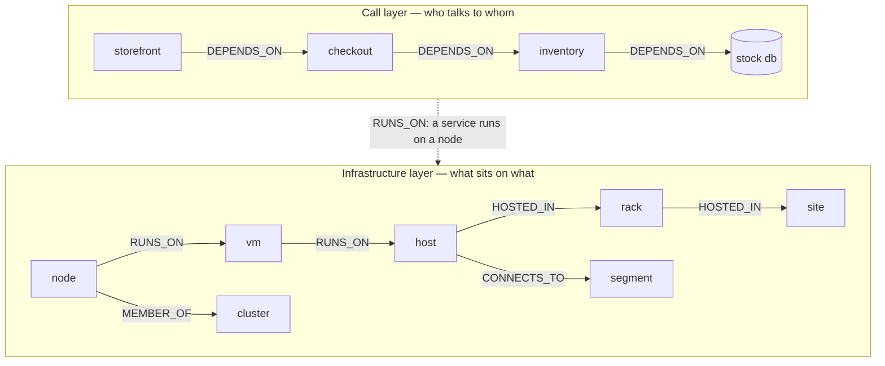
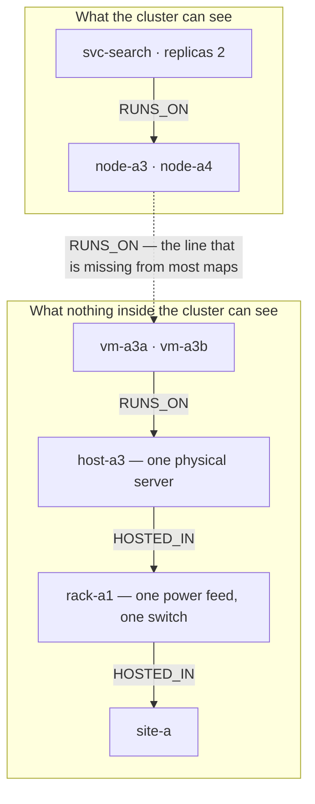

> **Note** — This README is also available in [한국어](README.ko.md).

<h1>orrery</h1>

[](https://github.com/yim0823/orrery/actions/workflows/ci.yml)
[](LICENSE)
[](pyproject.toml)
[](#project-status)

**orrery computes what else fails when one thing in your infrastructure does.**

You model your estate as a graph. orrery answers two questions over it: what is in
range of a failure, and what actually goes down once redundancy and failover are taken
into account. It models one thing failing, not a change being applied — "reboot this
host" is expressed as that host going down.

> ⚠️ **Early alpha.** The engine works, is tested, and can grade itself against past
> incidents — but it has not been graded against *yours*, and accuracy is the open
> question. Expanded in [Project status](#project-status).

---

## The question it answers

```console
$ orrery blast host-a1

root: host-a1 (host)
  hop 1: node-a1 (node), db-stock (database)
  hop 2: svc-web (service), svc-inventory (service)
  hop 3: svc-checkout (service)
impacted: 5 / 25
```

One host, and three hops later your checkout service is in the list. `host-a1` and
`svc-checkout` are never directly connected — a node, a database and an inventory
service sit in between. Tracing that by hand, at 3am, is where outages get longer.

**But "in range" is not "down".** Whether something actually dies depends on
replicas and failover, so there is a second command:

```console
$ orrery simulate host-a1

  host-a1                  -> down      passthrough
  node-a1                  -> down      passthrough
  db-stock                 -> down      
  svc-web                  -> degraded  lost one of its places to run
  svc-inventory            -> down      hard dep down
  svc-checkout             -> down      hard dep down
```

Same host, different answer:

- `svc-web` **degrades** — it still has another node to run on. Not because anything
  declares a replica count; because the graph has another `RUNS_ON` edge.
- `svc-inventory` **dies** — the database it needs died with the host.
- `svc-checkout` **dies with it** — hard dependency on inventory.

What you need on a page at 3am is not "5 impacted". It is *"checkout stops, because the
stock database went with the host."*

---

## Quickstart

Requires Python 3.12+ and [uv](https://docs.astral.sh/uv/).

```bash
git clone https://github.com/yim0823/orrery && cd orrery
uv sync
uv run orrery ingest fixtures/demo-world.yaml
uv run orrery blast site-a
uv run orrery simulate db-stock
```

**Names.** The distribution is `orrery-engine`; the import and the command are `orrery`.
`orrery` on PyPI is an unrelated project, so the short name was never available — see
[ADOPTING.md](docs/ADOPTING.md) for the dependency line. Nothing is published yet.

`fixtures/demo-world.yaml` is a small synthetic company — two sites, two racks, four
physical hosts, five services, two databases. One corner of it is virtualized, and that
corner contains a trap that the rest of this README is about. It resembles no real
organization.

### Commands

| Command | What it does |
|---|---|
| `orrery ingest <file.yaml>` | Load a world and persist it under `.orrery/` |
| `orrery blast <entity-id>` | Structural blast radius: what is in range, by hop |
| `orrery simulate <entity-id>` | Behavioral result: what actually degrades or dies |
| `orrery resolve <file.yaml>` | Propose entity-resolution candidates (never merges) |
| `orrery check` | Is this map any good? Gaps and drift in the map itself |
| `orrery spof` | What is most dangerous? Entities ranked by what goes with them |
| `orrery diff <a> <b>` | What changed between two snapshots — structure, and which findings appeared |
| `orrery backtest <dir>` | Replay past incidents and score the engine against them |

## Two questions you have on day one

Before any incident history exists, before anyone has calibrated anything, and before you
have modelled a single dependency by hand. Both run on whatever the first connector gave
you.

```console
$ orrery spof --limit 5

single points of failure, by what goes with them (26 entities)

    1. site-a        16 (64.0%)  site
    2. rack-a1       15 (60.0%)  rack
    3. k8s-main       9 (36.0%)  cluster
    4. etcd           6 (24.0%)  cluster
    5. host-a3        6 (24.0%)  host
```

Structural reach, and deliberately blind to any declared redundancy — redundancy that is
recorded but not real is exactly what this list exists to surface. `host-a3` in fifth
place is one physical server carrying two Kubernetes nodes that the cluster believes are
independent; see [the layer people forget](#the-layer-people-forget-what-the-cluster-is-standing-on).

```console
$ orrery check

map: 26 entities, 37 relations
  sources: static_yaml (26)
  0 entities confirmed by more than one source, 26 by exactly one

redundancy on paper only (1)
  svc-checkout                         replicas=2 but one place to run: losing it loses everything

redundancy on one machine (1)
  svc-search                           2 places to run, all of them on a3 — losing it loses all of them

isolated (1)
  svc-inventory-prod                   nothing connects to it — usually a join that failed, not a server nobody uses
```

`redundancy on paper only` is a service claiming two replicas with one recorded place to
run. `redundancy on one machine` is a service with two real places to run that both stand
on the same physical server. `isolated` is usually a join that failed quietly, not a
server nobody uses. None of the three is an error; all three are worth someone looking at
before the map is trusted.

---

## The two layers of a map

A dependency map is built from two kinds of edge, and they come from different places, cost
different amounts of effort, and answer different halves of the question. Confusing them is
the most expensive mistake available here, because a map with only the first kind looks
finished and answers wrongly.



| | Infrastructure layer | Call layer |
|---|---|---|
| The question | what sits on what | who talks to whom |
| Edges | `RUNS_ON`, `HOSTED_IN`, `MEMBER_OF`, `CONNECTS_TO` | `DEPENDS_ON` |
| Where it comes from | inventory: a CMDB, a cloud API, Kubernetes | **not in any inventory** — it is what the code does |
| Effort | a connector per source | the hard part, see below |
| Without it | you have no map at all | "this server is down" instead of "checkout stops" |

The two join on identity: a service in the call layer `RUNS_ON` a node in the
infrastructure layer. Getting that join right is what entity resolution is for, and getting
it wrong splits one thing into two and makes both answers wrong.

### The layer people forget: what the cluster is standing on

Virtualization makes redundancy easy to fake without anyone meaning to. A Kubernetes node
is usually not a physical server — it is a virtual machine, on OpenStack or EC2 or a
hypervisor someone else operates — and several of those virtual machines commonly sit on
one physical server.



Everything the cluster knows is true. There really are two nodes. **The count is not the
thing that is wrong — the assumption that the two are independent is**, and that
assumption lives entirely inside the line the map does not have. Kubernetes cannot correct
it, because Kubernetes does not know what it is standing on. The map is the only place the
question can be asked at all.

This is why `vm` is a separate kind from `host` rather than another word for it. Collapse
the two and the chain loses a level, and the moment it does, the trap becomes invisible. A
map that has the level gets the finding by name — this is `orrery check` on the shipped
fixture, not an illustration:

```
redundancy on one machine (1)
  svc-search    2 places to run, all of them on a3 — losing it loses all of them
```

Two machines that share only a rack are the same defect with a different fix — move a
server, rather than move a virtual machine — so they are reported under their own name.
The shipped fixture does not contain this case; on a map that does, it reads:

```
redundancy in one rack (1)
  svc-orders    2 places to run on different machines, all in a1 — one power feed, one top-of-rack switch
```

Only the nearest shared foundation is reported. A service on one hypervisor is also, by
construction, in one rack and one site; saying all three would be three findings for one
defect.

**Sharing a *site* is not reported at all.** Everything in one datacentre is a fact about
the estate rather than a defect, and a finding on every service is how people learn to
skip the report. What is worth reporting is the level someone could plausibly not know
about and could act on this week.

### Where the call layer actually comes from

Every inventory system knows where things run. None of them knows what calls what, because
that is a property of running code rather than of an asset register. There are three ways
to find out, and only one of them is usually available:

| Approach | Touches the application? | What it costs you |
|---|---|---|
| **Distributed tracing** — OpenTelemetry, Jaeger, Zipkin | **Yes** — a library in every service | Realistic only where every service can be instrumented and every hop propagates context. One service that does not breaks the graph from there on. Not an option for legacy or native code. |
| **eBPF** — Pixie, SkyWalking Rover, Cilium Hubble | No | Kubernetes-shaped, kernel requirements, an agent on every node |
| **Connection observation** — flow logs, firewall logs, socket tables (`osquery process_open_sockets`, `ss`) | **No** | Coarse: you learn `host A → host B:9000`, not which endpoint. Traffic that never crosses an observation point is invisible. |

The third is the one that works on an estate you did not design, and it is the one most
tools skip because they assume tracing. Joining "A talks to B on port 9000" with "port 9000
on B is the inventory service" gives you a `DEPENDS_ON` edge without touching a single
application.

Coarse is enough here. Blast radius asks what breaks, not which endpoint breaks.

---

## Modeling your own infrastructure

A world is **entities** and **relations**, nothing else.

```yaml
entities:
  - {id: host-a1,      kind: host,     name: "a1"}
  - {id: node-a1,      kind: node,     name: "node-a1"}
  - {id: svc-checkout, kind: service,  name: "checkout"}
  - {id: db-orders,    kind: database, name: "orders"}

relations:
  - {src: node-a1,      dst: host-a1,   kind: RUNS_ON}
  - {src: svc-checkout, dst: node-a1,   kind: RUNS_ON}
  - {src: db-orders,    dst: host-a1,   kind: RUNS_ON}
  - {src: svc-checkout, dst: db-orders, kind: DEPENDS_ON}
```

Every id in `relations` must already exist in `entities`; ingest refuses a dangling
reference rather than inventing the missing end.

Note what is *not* here: no `replicas`, no `replica: true`. **Redundancy is somewhere to
run, not a number you assert.** A service with three `RUNS_ON` edges survives losing one;
a service with `replicas: 3` and one `RUNS_ON` edge does not, and `orrery check` will tell
you which one you have built.

Six relation kinds. The arrow always points **from the dependent to the depended-upon**
— reverse one and the blast radius is silently wrong.

There are seventeen entity kinds (`orrery ingest` will list them if you mistype one); the
ones in the demo are `site`, `rack`, `host`, `vm`, `cluster`, `node`, `service`,
`database`, `load_balancer` and `external`. Each kind earns its place by failing
differently — `vm` and `host` are separate for the reason given
[above](#the-layer-people-forget-what-the-cluster-is-standing-on).

| Kind | Layer | Reads as |
|---|---|---|
| `RUNS_ON` | infrastructure | service runs on node; node runs on vm; vm runs on host |
| `HOSTED_IN` | infrastructure | host is hosted in a rack; rack in a site |
| `MEMBER_OF` | infrastructure | node is a member of a cluster |
| `REACHED_VIA` | infrastructure | service is reached through a load balancer, DNS name or CDN |
| `CONNECTS_TO` | infrastructure | host is attached to a network segment |
| `DEPENDS_ON` | call | service depends on a database |

All five propagate impact. `CONNECTS_TO` was excluded once, on the reasoning that
communication is symmetric — but a host's single attachment to a segment is not symmetric,
and the exclusion made every top-of-rack failure compute as affecting nothing.

### Hard and soft dependencies

Not everything you depend on is load-bearing. Lose your primary database and you stop.
Lose a payment provider and, if you queue and retry, you keep taking orders — the cart
still works, confirmation is just late.

```yaml
relations:
  - {src: svc-checkout, dst: db-orders,    kind: DEPENDS_ON}                   # hard
  - {src: svc-checkout, dst: ext-payments, kind: DEPENDS_ON, strength: soft}
```

A soft edge **caps what crosses it at "degraded"**. It weakens the consequence; it does
not silence it. A storefront whose checkout is slow is itself slow.

`strength` defaults to `hard`, deliberately. Marking something soft when it is not hides
a real outage; marking something hard when it is not produces a false alarm. The first
failure hurts people, the second annoys them — so when in doubt, leave it hard.

### Connectors

orrery ships the **interface**. One implementation comes with it —
`orrery.connectors.kubernetes`, which reads `kubectl get -o json` — as a worked example.
Connectors to your CMDB or monitoring live in your own repository, because no two
organizations model those the same way.

```python
from orrery.connectors.base import Discovery
from orrery.schema import Entity, Relation, EntityKind, RelationKind, Provenance

class MyCmdbConnector:
    name = "mycmdb"

    def discover(self) -> Discovery:
        d = Discovery()
        for row in my_cmdb.list_servers():
            d.entities.append(Entity(
                id=f"host-{row['id']}", kind=EntityKind.HOST, name=row["hostname"],
                attrs={"ip": row["ip"], "env": row["env"]},
                provenance=[Provenance(source="mycmdb", source_id=row["id"])],
            ))
            d.relations.append(Relation(
                src=f"host-{row['id']}", dst=f"site-{row['idc']}",
                kind=RelationKind.HOSTED_IN,
                provenance=[Provenance(source="mycmdb", source_id=row["id"])],
            ))
        return d
```

Implement `discover()` and nothing else. Results from multiple connectors merge.

### Entity resolution never merges automatically

Your CMDB calls it `inventory`; your monitoring calls it `inventory-prod`. Two names
means two nodes in the graph, which means both blast radii are wrong.

```console
$ orrery resolve fixtures/demo-world.yaml
candidate: svc-inventory (inventory) | svc-inventory-prod (inventory-prod)
```

orrery proposes; a human confirms. This is deliberate. A wrongly merged map is worse
than no map — people distrust a missing map, but a wrong one answers confidently, and
someone acts on that answer at 3am.

---

## What orrery is not

- **Not monitoring.** Your existing tools tell you what is broken now. orrery computes
  what would break.
- **Not an APM service map.** Those draw observed traffic, so they miss nightly batch
  paths, failover routes, and services with no load yet. orrery uses declared structure.
- **Not a CMDB.** Inventory lives in your CMDB. orrery is a compute layer on top.
  Do not run a second source of truth; two will diverge, and then neither is trusted.
- **Not a second production.** Nothing is actually executed. Entities are objects and
  behavior models; only the region under examination is computed in detail.

---

## Grading a map you already have

You do not need to adopt the engine to use the harness. If your dependencies already live
in a graph, read them out, and let your own past incidents tell you how good that map is:

```python
import pathlib

from orrery.adapters.neo4j import LabelMap, Neo4jSource
from orrery.schema import EntityKind, RelationKind

world = Neo4jSource(driver, LabelMap(
    entity_labels={"Server": EntityKind.HOST, "App": EntityKind.SERVICE},
    relation_types={"DEPLOYED_ON": RelationKind.RUNS_ON, "CALLS": RelationKind.DEPENDS_ON},
)).load()
pathlib.Path("snapshots").mkdir(exist_ok=True)   # save writes, it does not create
world.save("snapshots/2026-03.yaml")
```

Then write incidents against that snapshot and run `orrery backtest`. The number that
comes out — "the map predicted 19 of 26 impacts, missed 2, over-called 2" — is a claim
about your map, not about this tool. It is the only number we know of that lets you say
anything precise about a dependency map at all, and we would rather be shown a better one
than be right about that.

---

## Documentation

- [Architecture](docs/ARCHITECTURE.md) — data model, propagation, extension points, tradeoffs
- [Architecture (한국어)](docs/ARCHITECTURE.ko.md) — the Korean translation. Its §2 is current; the rest is at 0.1.0 and says so. The English one is the reference
- [Clean-room rules](CLEANROOM.md) — what may never enter this repository
- [Contributing](CONTRIBUTING.md)

---

## Project status

Early alpha, `0.3.0`. Honest picture:

**Licensing.** Apache-2.0, copyright TaeHyoung Yim — see [`LICENSE`](LICENSE) and
[`NOTICE`](NOTICE). Nothing in this repository is specific to any company, and a
fail-closed commit hook keeps it that way; [`CLEANROOM.md`](CLEANROOM.md) is the rule and
how it is enforced.

| Works | Not yet |
|---|---|
| Entity/relation model, YAML ingest, snapshot diffing | Connectors to real systems — Kubernetes is the only one |
| Structural blast radius and behavioral propagation | Capacity: whether the survivors can carry the load |
| Hard and soft dependencies, tolerance windows, quorum | Magnitude: two of three replicas lost reads as one |
| Entity-resolution candidates | Visualization — terminal and JSON only |
| Machine-readable output, Neo4j source | Time that advances on its own, and more than one actor |
| Map audit (`check`) and risk ranking (`spof`) | Materializing part of the world as real running systems |
| Backtesting harness | |

**Accuracy is the open problem, and measuring it is the part nobody else does.**

Plenty of tools will draw you a dependency map, and several draw better ones than this.
Looking across the field in 2026 — CMDB and application-dependency-mapping products,
observability service maps, chaos platforms, developer portals — we did not find one that
scores its own map against what actually happened in past incidents. **That is a survey,
not a proof**, and it is the claim this project is most exposed on: if a tool you use does
this, the honest thing is to use that tool and close this tab. What the harness does is
score a map, and **it does not require the map to be orrery's.** Point `orrery.adapters.neo4j` at a graph you already run, save the snapshot,
write your incidents against it, and the thing being graded is your existing map.

```console
$ orrery backtest fixtures/incidents

backtest: 6 incident(s), 24 prediction(s) scored
  78 entit(ies) skipped — the records say nothing about them

  recall    100%   of what broke, we called broken at all
  precision 100%   of the predictions someone checked, right
  exact     96%   severity exactly right
  on breaks 95%   severity exactly right, counting only what broke

  ⚠ 5 prediction(s) of breakage nobody checked. Precision cannot see them,
    so it is an upper bound: over-predicting is free until the records say otherwise.

  hit            19   predicted, right severity
  correct up      4   agreed it was unaffected
  understated     1   said degraded, was down
  overstated      0   said down, was degraded
  false alarm     0   said broken, was fine
  MISS            0   said fine, was broken

⚠ fewer than 30 scored predictions. Treat these rates as a smoke test, not a measurement.
⚠ every incident replays against one snapshot. If that snapshot was written after the
  incidents, this measures hindsight rather than prediction — an edge learned from a
  postmortem is already in the map being graded.
```

Write your past incidents as records — what broke, and what was *observed* to break —
and the engine grades itself. Two design choices matter:

- **Silence is not health.** An entity your record says nothing about is skipped, not
  scored as healthy. You only learn about what someone noticed at the time, and counting
  unexamined systems as fine inflates every number on this report.
- **Severity counts.** Predicting "down" when something merely degraded is not a hit. It
  is `overstated`, and it is why `exact` is reported separately from `recall` — and why
  `on breaks` is reported separately again, since agreeing that untouched things were
  untouched is most of what a raw `exact` measures.

The harness has earned its keep twice. Its first run found three defects — arrival order
deciding whether a service came out degraded or down, quorum ignored entirely, and a
service that trusted a `replicas` attribute instead of counting the nodes actually left.
(A fourth, the absence of soft dependencies, came out of the next run.) An adversarial
review then found that the last of the three was
only half fixed: propagation counted survivors and the behavior model then overrode the
count with the attribute anyway, so a service on forty-nine healthy nodes was reported
down when one rebooted. That review also found that a network segment failing computed as
affecting nothing, because the edge that attaches a host to it was excluded from impact.

Read that as the argument for the harness rather than against the engine: both classes of
defect were invisible to a green test suite, and the second was invisible to the harness
too until someone went looking for it deliberately.

The one `understated` result left is deliberate, in `fixtures/incidents/INC-0006.yaml`:
**the engine knows whether somewhere is left to run, not whether the survivors can carry
the load.** One node was lost at peak; structurally the storefront survived, and in
reality the remaining node took the whole load and fell over. Answering that needs
capacity modelling, which may not belong in a structural engine at all.

A backtest containing only incidents the engine already handles measures nothing.

**Read the report's own warnings.** Precision is computed over predictions somebody
actually checked, so it is an upper bound: the report prints how many predictions nobody
verified, and until that number is small, over-predicting is free. Recall counts a
prediction of "degraded" for something that died as caught, which is why `on breaks` —
severity exactly right, counting only what broke — is the number to watch. And if every
incident replays against one snapshot written after the fact, the exercise measures
hindsight rather than prediction; the report says that too.

Until you have run this against your own incidents, treat the output as advisory and say
so to anyone who asks.

Performance, measured rather than asserted — one laptop, and reproducible:

```bash
uv run python scripts/bench.py --hosts 10000 --repeat 10
uv run python scripts/bench.py --hosts 50000 --repeat 3
```

| World | blast (whole site) | simulate | fork |
|---|---|---|---|
| 25,508 entities | 53 ms | 164 ms | below timer resolution |
| 127,508 entities | 307 ms | 1.1 s | below timer resolution |

The large numbers are the pathological case: a whole site failing and reaching a third of
the estate. A single host or database is an order of magnitude cheaper.

`spof` is the one to watch, and memory is its limit rather than time — it holds reach as a
bitset per component, so it grows with the square of the estate. Past a few hundred
thousand entities it needs a different algorithm, not a bigger machine. **`bench.py` does
not time it**, so there is no number here to quote; the generated world also has no rack
or vm layer, which means it cannot exercise `check` either. Both are gaps in the benchmark
rather than claims about the commands.

---

## Contributing

Issues and pull requests are welcome. Please read [CONTRIBUTING.md](CONTRIBUTING.md)
first — in particular the clean-room rule, which is enforced by a commit hook.

```bash
uv sync
uv run pytest
uv run ruff check .
```

## License

[Apache-2.0](LICENSE).

---

<sub>An orrery is a mechanical model of the solar system. Every planet is on the model,
and when you turn the crank, every position is computed.</sub>
